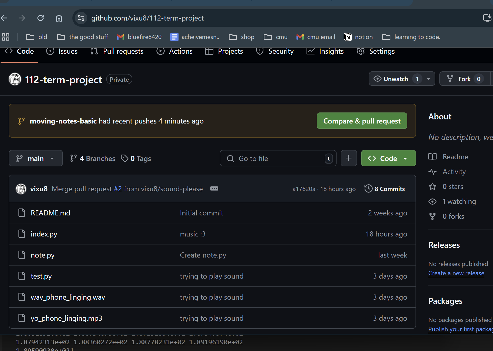

Project Title: Rhythm Game

Description: This will be a rhythm game similar to piano tiles, with notes falling from the top of the screen. 
The player will use sdfjkl keys to press corresponding columns to hit notes. 
Depending on how on time they hit the keys, different point values will be awarded.
The score will be totaled at the end.

Similar projects: Piano Tiles, Phigros, Cytus 2

Version control: I'm using a private Github repo

Tech list: librosa, pygame, numpy